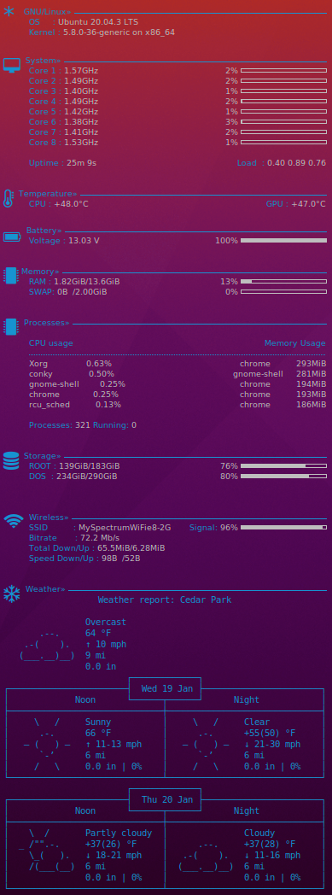

# Conky Linux Widget

This is a script that produces a widget for linux. The widget looks as follows:



It shows the basic system details, weather, details of wireless connection, and battery usage.

## How to Install

1. Install conky using command ```sudo apt-get install conky-all```
2. Download this repository and double click on the ConkySymbols.ttf file to install the fonts.
3. Place the .conkyrc file in the home folder.
4. Install the fonts-font-awesome package for additional fonts.
5. Start conky by running command ```conky``` in a terminal.

To toggle conky to show up as a panel and then hide, link the toggle-conky.sh script to any shortcut key. This will enable you to use that shortcut key to show conky when you are working with other applications.
